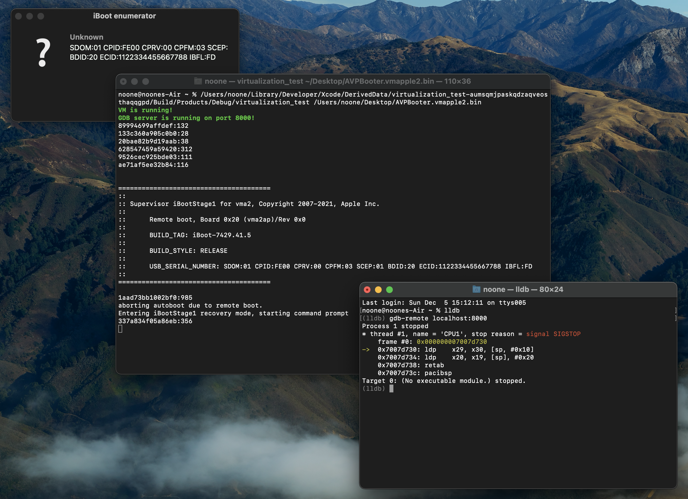

# Virtual iBoot Fun

This is just another **Virtualization.framework** sample project (WIP), but with focus on iBoot (iOS/macOS/tvOS/etc. bootloader)

*For a more canonical example of a VM (with GUI, installation and etc.), look into [@\_saagarjha's **VirtualApple** project](https://github.com/saagarjha/VirtualApple)*

The code is written in **Objective-C**, quite well commented and this README serves as a little documentaion as well

This far I've managed to boot up to a patched kernel with **GDB server** and **debug UART** enabled, as well as many platform properties controlled (BDID, production mode and etc.)

Only tested under Monterey 12.0.1




## Usage
### Requirements

* **Apple Silicon Mac** booted with `amfi_get_out_of_my_way=1` boot-arg - the last bit is required because otherwise macOS won't accept `com.apple.private.virtualization` entitlement (we'll call it "the *private* entitlement" from now on). And if it won't - the most interesting functions will be restricted. Setting such boot-arg is only allowed with many security feautures disabled, so be careful!
* **iRecovery** - to send images and commands to bootloaders
* **img4lib** - to create Image4s


### Options

```
usage: virtualization_test [OPTIONS]
        -r      path to custom ROM
        -a      path to auxiliary storage, default - /tmp/aux.bin
        -s      path to storage, must already exist, defualt - disabled
        -d      debug port, default - disabled
        -v      platform version, default - 2
        -c      count of CPUs, default - 1
        -m      memory size in GiBs, default - 2
        -b      board ID, default - defined by platform version
        -e      ECID, default - random
        -p      demote production mode
        -f      force DFU
```

* `-r` - path to custom ROM, aka **AVPBooter** - the new iBoot flavor - usually can be found at `/System/Library/Frameworks/Virtualization.framework/Versions/A/Resources/AVPBooter.vmapple2.bin`. There're no signature checks for it, but it requires the *private* entitlement
* `-a` - path to auxiliary storage, (apparently) used for storing non-FS things (flashed firmware, NVRAM, etc.). If the file you provide doesn't exist, it will create it on its' own
* `-s` - path to disk storage, optional, a supplied file must already exist
* `-d` - debug port for GDB server. Requires the *private* entitlement. Note that debugging works real bad when VM runs **AVPBooter**
* `-v` - platform version. Valid values are 1 and 2. The first makes it use BDID:F8 (only works when using custom ROM), the second - BDID:20 and it's a default value
* `-c`, `-m`, `-b`, `-e` - various properties that speak for themselves. The only caveat here is that **iBootStage1** will panic if RAM size is below 2 GiBs (or near enough - definitely doesn't work with just one)
* `-p` - demote production mode, makes it run with CPFM:01 instead of 03. Currently unclear what this is useful for - **GDB** debug will work either way. Requires the *private* entitlement
* `-f` - force DFU, usefull if the auxiliary storage contains something bootable. Please note, that DFU is only forced on first boot, i.e. if you soft reboot the machine it won't work anymore


## Booting iBootStage1
### Patching AVPBooter

First of all, we have to modify the **AVPBooter** with the canonical signature check patch, which is in essence the following:

* Find `image4_validate_property_callback()` - by searching for `0x4345` (ASCII `CE` as in `CEPO`)
* Make it always return 0 - by replacing the beginning of the function to `000080D2 C0035FD6` (`MOV X0, #0x0` `RET`)

This way, whenever `libImg4Decode` tries to validate some **Image4 Manifest** property, it will always think it was validated successfully

For `AVPBooter-7429.41.5` (shipped with Monterey 12.0.1) this patch' position is at `0xBAC`


### Constructing iBSS IMG4

**IM4P** files (**IM**age**4****P**ayload) you can find in an **IPSW** are not enough to be loaded by **AVPBooter**. First, one has to extend them with **IM4M** (**IM**age**4****M**anifest). Quite easy with `img4lib`:

```
img4 -i iBSS.vma2.RELEASE.im4p -o iBSS.vma2.RELEASE.img4 -M tickets/vma2_ticket.der
```

***Warning**: do not use manifests provided by an IPSW - for the reasons yet to be found it will fail to boot and AVPBooter will hang somewhere. Use one provided by TSS, such as the one provided by this repository*


### Booting!

Launch the program with your freshly patched ROM:

```
noone@noones-Air ~ % virtualization_test -r AVPBooter.vmapple2.patched.bin
VM is running!
```

If everything's fine, you'll see a green text "VM is running!" and new DFU-device on USB, such as this - `SDOM:01 CPID:FE00 CPRV:00 CPFM:03 SCEP:01 BDID:20 ECID:CAD01AC095BA1AD8 IBFL:3C SRTG:[iBoot-7429.41.5]`

Then send the **iBootStage1**/**iBSS** (from another terminal):

```
noone@noones-Air ~ % irecovery -f iBSS.vma2.RELEASE.img4
[==================================================] 100.0%
```

You should see something like this in the log (yes, it also serves as serial monitor):

```
noone@noones-Air ~ % virtualization_test -r AVPBooter.vmapple2.patched.bin
VM is running!
89994699affdef:132
133c360a905c0b0:28
20bae82b9d19aab:38
628547459a59420:312
9526cec925bde03:111
ae71af5ee32b84:116


=======================================
::
:: Supervisor iBootStage1 for vma2, Copyright 2007-2021, Apple Inc.
::
::      Remote boot, Board 0x20 (vma2ap)/Rev 0x0
::
::      BUILD_TAG: iBoot-7429.41.5
::
::      BUILD_STYLE: RELEASE
::
::      USB_SERIAL_NUMBER: SDOM:01 CPID:FE00 CPRV:00 CPFM:03 SCEP:01 BDID:20 ECID:CAD01AC095BA1AD8 IBFL:FD
::
=======================================

1aad73bb1002bf0:985
aborting autoboot due to remote boot.
Entering iBootStage1 recovery mode, starting command prompt
337a834f05a86eb:356
```

...as well as `Apple Mobile Device (Recovery Mode)` (`SDOM:01 CPID:FE00 CPRV:00 CPFM:03 SCEP:01 BDID:20 ECID:CAD01AC095BA1AD8 IBFL:FD`) device on USB

You can interact with it using **iRecovery** in the same way as if it was a real device:

```
noone@noones-Air ~ % irecovery -s


=======================================
::
:: Supervisor iBootStage1 for vma2, Copyright 2007-2021, Apple Inc.
::
::      Remote boot, Board 0x20 (vma2ap)/Rev 0x0
::
::      BUILD_TAG: iBoot-7429.41.5
::
::      BUILD_STYLE: RELEASE
::
::      USB_SERIAL_NUMBER: SDOM:01 CPID:FE00 CPRV:00 CPFM:03 SCEP:01 BDID:20 ECID:CAD01AC095BA1AD8 IBFL:FD
::
=======================================

1aad73bb1002bf0:985
aborting autoboot due to remote boot.
Entering iBootStage1 recovery mode, starting command prompt
> 
```


## Booting further

Week after the initial release of this program, I've managed to boot up to a patched kernel. (Very dirty) patches for iBoots and kernel are available here in this repo under `patches/` - they are all in **bsdiff43** format - use [this](https://github.com/mendsley/bsdiff) to apply them on *raw unpacked* files. Make sure you don't use **bspatch** that's embedded to macOS!

*Documentaion for patches will come later*

Once you patch and pack everything, here's a script you can you use to boot:

```
irecovery -f iBSS.vma2.RELEASE.patched.img4     # send iBootStage1
sleep 1                                         # wait for it
irecovery -f localpolicy.img4   # send LocalPolicy, sample is available in the repo as well
irecovery -c lpolrestore        # apply it
irecovery -f iBEC.vma2.RELEASE.patched.img4     # send iBootStage2
irecovery -c go                                 # boot it
sleep 1                                         # wait for it
irecovery -f devicetree.img4    # send DeviceTree
irecovery -c devicetree         # apply it
irecovery -f ramdisk_custom.img4        # send ramdisk (not provided)
irecovery -c ramdisk                    # apply it
irecovery -f trustcache.img4    # send trustcache (not provided)
irecovery -c firmware           # apply it
irecovery -f kernelcache.patched.img4           # send kernelcache
irecovery -c "setenv boot-args rd=md0 serial=3" # apply boot-args
irecovery -c bootx      # boot it all
```

If all went good, you will see a log like this:

```
noone@noones-Air virtualization_test % virtualization_test -a aux_non_restored.img -f -r AVPBooter.vmapple2.patched.bin -d 8000
VM is running!
GDB server is running on port 8000!
89994699affdef:132
133c360a905c0b0:28
20bae82b9d19aab:38
628547459a59420:312
9526cec925bde03:111
ae71af5ee32b84:116


=======================================
::
:: Supervisor iBootStage1 for vma2, Copyright 2007-2021, Apple Inc.
::
::      Remote boot, Board 0x20 (vma2ap)/Rev 0x0
::
::      BUILD_TAG: iBoot-7429.41.5
::
::      BUILD_STYLE: RELEASE
::
::      USB_SERIAL_NUMBER: SDOM:01 CPID:FE00 CPRV:00 CPFM:03 SCEP:01 BDID:20 ECID:92C8A052857994E2 IBFL:FD
::
=======================================

1aad73bb1002bf0:985
aborting autoboot due to remote boot.
Entering iBootStage1 recovery mode, starting command prompt
337a834f05a86eb:356
ea0f64a4253252:448
1d48c592ce4f38c:3137
ea0f64a4253252:448
f6978074aebb397:166
10d9a6f0bc00891:515
133c360a905c0b0:75
======== End of iBootStage1 serial output. ========
89994699affdef:160
133c360a905c0b0:28
20bae82b9d19aab:38
628547459a59420:312
ae71af5ee32b84:116
ee37000f60f2e6c:128


=======================================
::
:: Supervisor iBootStage2 for vma2, Copyright 2007-2021, Apple Inc.
::
::      Remote boot, Board 0x20 (vma2ap)/Rev 0x0
::
::      BUILD_TAG: iBoot-7429.41.5
::
::      BUILD_STYLE: RELEASE
::
::      USB_SERIAL_NUMBER: SDOM:01 CPID:FE00 CPRV:00 CPFM:03 SCEP:01 BDID:20 ECID:92C8A052857994E2 IBFL:BC SRNM:[Z5JY2CMNP7]
::
=======================================

1aad73bb1002bf0:985
aborting autoboot due to tethered restore.
Entering iBootStage2 recovery mode, starting command prompt
337a834f05a86eb:356
ea0f64a4253252:448
loaded device tree at <ptr> of size 0x100000, from image at <ptr>
ea0f64a4253252:448
loaded ramdisk at <ptr> of size 0x9b95e00, from image at <ptr>
ea0f64a4253252:448
ea0f64a4253252:448
ea0f64a4253252:448
10d9a6f0bc00891:940
62039c63193986a:240
1d48c592ce4f38c:1030
a60aa294185a059:586
a60aa294185a059:589
dce7b01f6ef60a3:1602
10d9a6f0bc00891:885
10d9a6f0bc00891:123
133c360a905c0b0:75
======== End of iBootStage2 serial output. ========
Darwin Kernel Version 21.1.0: Wed Oct 13 17:33:22 PDT 2021; root:xnu-8019.41.5~1/RELEASE_ARM64_VMAPPLE
pmap_startup() init/release time: 1455 microsec
pmap_startup() delayed init/release of 0 pages
vm_page_bootstrap: 112609 free pages, 17789 wired pages, (up to 0 of which are delayed free)
VM boostrap: 107 maps, 408 entries and 512 holes available
"vm_compressor_mode" is 4
VM bootstrap done: 100 maps, 395 entries and 512 holes left
Long logs support configured: size: 16384
Firehose configured: 16 chunks, 8 io pages
Log queues configured: slot count: 8, per-slot size: 32768, total size: 262144
standard timeslicing quantum is 10000 us
standard background quantum is 2500 us
WQ[wql_init]: init linktable with max:262144 elements (8388608 bytes)
WQ[wqp_init]: init prepost table with max:262144 elements (8388608 bytes)
mig_table_max_displ = 53 mach_kobj_count = 401
kdp_core zlib memory 0x8000
Serial requested, consistent debug disabled or debug boot arg not present, configuring debugging over serial
iBoot version: iBoot-7429.41.5
Darwin Image4 Validator Version 4.1.0: Thu Oct 14 00:45:51 PDT 2021; root:AppleImage4-157.40.10~248/AppleImage4/RELEASE_ARM64E
AppleImage4: failed to read nvram property: oblit-inprogress: 2
AMFI: UDID enforcement enabled
calling mpo_policy_init for AMFI
Security policy loaded: Apple Mobile File Integrity (AMFI)
calling mpo_policy_init for Sandbox
Security policy loaded: Seatbelt sandbox policy (Sandbox)
calling mpo_policy_init for Quarantine
Security policy loaded: Quarantine policy (Quarantine)
1 external trust cache modules available.
external trust cache module 0 with 422 entries
IOResources: not registry member at registerService()
IOResources: not registry member at registerService()
IOG flags 0x3 (0x51)
...
```

**To Be Continued** (maybe...)


## Known issues

* Although iBoot passes all the boot-args you want to kernel, kernel can ignore the most interesting ones (`debug=...`, `amfi_get_out_of_my_way=1`, etc.). This should be fixable either with proper LocalPolicy or with more kernel patches 


## Credits

* @\_saagarjha
* @s1guza
* @pimskeks and other people behind libirecovery
* @xerub
